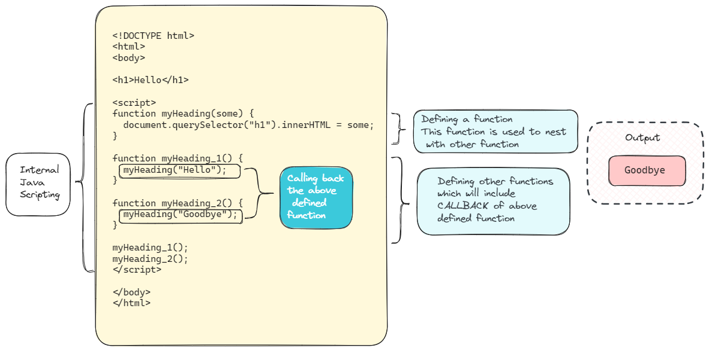
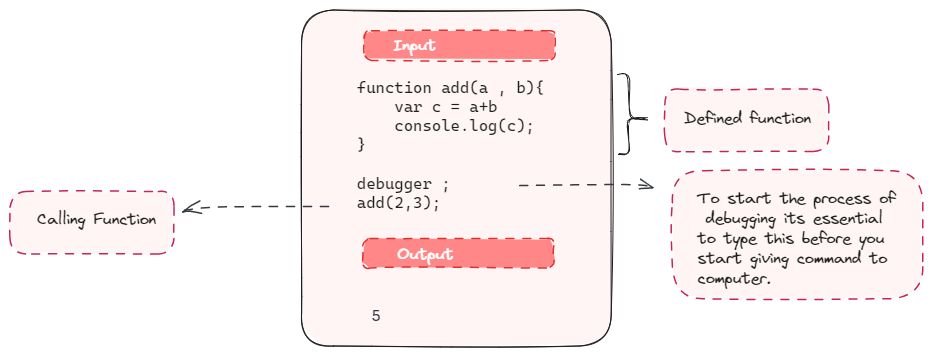

----
marp : true

----

 # WEEK # 4

 19 th June to 
 24 th June 

----
* ##  Higher Order Functions 
* ## Creating new objects   
* ## What is ``callback`` 
* ## Adding an Event listner    
* ## What is ``debugger``     
* ## Webpage creation : Drum Kit 
* ## JQuerry
    
---
* ##  Higher Order Functions 

_Higher order functions are functions that can take other functions as inputs_

for example : ``addEventListner``

---
* ## Creating new objects  
    * Constructor Function
    * Creating an Object
    * Properties
    * Method 
    * Use of ``this``
---
 * ### Constructor Function

_- Creates and initializes the object instance_
_- Object is created using new key word_
_- Setting values for any existing object properties._

source:https://rollbar.com/blog/javascript-constructors/#:~:text=A%20constructor%20is%20a%20special,for%20any%20existing%20object%20properties.

---
* ### Creating an Object
_- After initialization of constructor function new object is created._
_-  Instance of the about function_
 

source:https://www.w3schools.com/js/tryit.asp?filename=tryjs_object_constructor

---
* ### Properties
_-A JavaScript object is a data structure that stores a collection of properties._
_-A JavaScript property is a member of an object that associates a key with a value._

source:https://developer.mozilla.org/en-US/docs/Glossary/Property/JavaScript

---
* ### Method 
_-JavaScript methods are actions that can be performed on objects._
_-A JavaScript method is a property containing a function definition._

source:https://www.w3schools.com/js/js_object_methods.asp#:~:text=JavaScript%20methods%20are%20actions%20that,Value

---
* ### Use of ``this``

_-In JavaScript, the ``this`` keyword refers to an object._
_-The this keyword refers to different objects depending on how it is used:

source:https://www.w3schools.com/js/js_this.asp

---
Code Explanation

---
* ## What is ``callback`` 

_- JavaScript functions are executed in the sequence they are called. Not in the sequence they are defined._
_- A callback is a function passed as an argument to another function_
_- This technique allows a function to call another function_

source:https://www.w3schools.com/js/js_callback.asp

---

---

* ## Adding an Event listner 
    * Syntax
    * About its Backend

    Live demo : Basic Calculator 
---
* ### Syntax

``addEventListner`` is a function .
It taks two inputs ; ``addEventListner(input1 , input2)``

Input 1 : To what should I respond .  
Input 2 : How should I respond .

---

How to call the functions :

---
* ### About its Backend :

---

* ## What is ``debugger``
    
    * Its use with Chrome Developer tool
    * How to check flow of code using Debugger 
        * Live demo  
---
* ### What is ``debugger`` and its use with chrome developer tools

---
* ## Webpage creation : Drum Kit 
    * Adding sound 
    * What are ``switch`` statements 
    * Use of ``keypress`` event listner 

    Live demo: Drum Kit
---
* ## JQuerry

_- Write less do more_
_- wraps them into methods that you can call with a single line of code._

[JQuerry](https://jquery.com/)

Live demo: Plain website